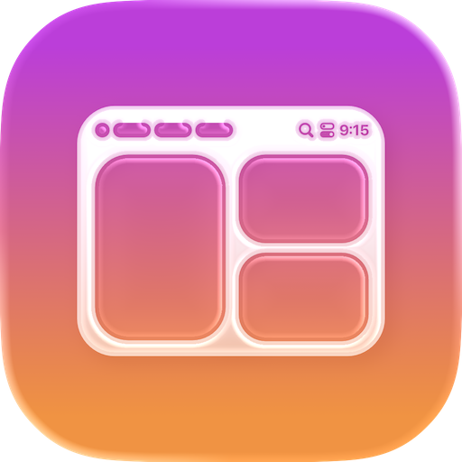

<!-- Copyright (c) 2026 AeroSpaceBar by Ronen Druker. -->

<!-- markdownlint-disable-next-line MD041 -->
<div align="center">

</div>

<h1 align="center">🚀 AeroSpaceBar</h1>

<div align="center">

[](LICENSE)
[](https://www.apple.com/macos/)

[](https://swift.org)
[](https://github.com/kudoleh/iOS-Clean-Architecture-MVVM)
[](https://github.com/rdrkr/AeroSpaceBar/actions/workflows/release.yaml)

**A modern macOS menu bar application for managing AeroSpace window manager spaces and windows with a beautiful
SwiftUI interface**

  
</div>

## 📖 Overview

AeroSpaceBar is a macOS menu bar application that provides seamless integration with
the [AeroSpace window manager](https://github.com/nikitabobko/aerospace). Built with modern SwiftUI and following Clean
Architecture principles, it offers an intuitive interface for managing your workspace spaces and windows directly from
the menu bar.

### ✨ Key Features

- 🎨 **Beautiful UI**: Modern SwiftUI interface with smooth animations and hover effects
- ⚡ **Lightning Fast**: Optimized performance with efficient data refresh and icon caching
- 🔒 **Privacy Focused**: Runs entirely locally, no data sent to external servers
- 🔧 **Spaces & Groups**: Organize and manage workspace windows and menubar groups with custom ranges and settings
- 🎨 **Advanced Theming**: Comprehensive theme system with presets and per-space customization
- 🌐 **System Integration**: Automatic menu bar visibility matching and wallpaper detection
- 🔄 **Software Updates**: Automatic update checking and installation via Sparkle
- ⚙️ **TOML Configuration**: Native support for AeroSpace TOML configuration file monitoring
- ⌨️ **Keyboard Shortcuts**: Global key detection and shortcut support

## 🚀 Installation

### Prerequisites

- **macOS 15.0+** (Sequoia or later)
- **[AeroSpace window manager](https://github.com/nikitabobko/aerospace)** installed and running

> [!NOTE]
> By using AeroSpaceBar, you acknowledge that it's
> not [notarized](https://developer.apple.com/documentation/security/notarizing_macos_software_before_distribution).
>
> Notarization is a "security" feature by Apple. You send binaries to Apple,
> and they either approve them or not. In reality, notarization is about
> building binaries the way Apple likes it.
>
> The [Homebrew installation script](https://github.com/rdrkr/homebrew-tap/blob/main/Casks/aerospacebar.rb) is configured to
> automatically delete the `com.apple.quarantine` attribute, that's why when installed via Homebrew the app should work out of
> the box, without any warnings that "Apple cannot check AeroSpaceBar for malicious software".
>
> If you install manually and macOS blocks the app from launching:
>
> - Right-click the app in Finder and choose "Open", then click "Open" again in the dialog
> - Or go to System Settings → Privacy & Security → click "Allow Anyway" for AeroSpaceBar
> - Or run: `xattr -dr com.apple.quarantine "/Applications/AeroSpaceBar.app"`

### Option 1: Homebrew (Recommended)

```bash
brew tap rdrkr/tap
brew install --cask aerospacebar
```

Or in one command:

```bash
brew install --cask rdrkr/tap/aerospacebar
```

### Option 2: Download Release

1. Visit the [Releases page](https://github.com/rdrkr/AeroSpaceBar/releases/latest)
2. Download the latest `.zip` file
3. Extract and drag `AeroSpaceBar.app` to your Applications folder

### Option 3: Build from Source

```bash
git clone https://github.com/rdrkr/AeroSpaceBar.git
cd AeroSpaceBar
./Scripts/build.sh
```

The built app will be at `build/Build/Products/Release/AeroSpaceBar.app`.

You can also open `AeroSpaceBar.xcodeproj` in Xcode and build with `Cmd + R`.

## 🎮 Usage

1. **Ensure AeroSpace is running** (`aerospace start`)
2. **Launch AeroSpaceBar** - the app icon appears in your menu bar
3. **Click the menu bar icon** to see all available spaces
4. **Click any space** to switch to it, or **hover** to preview its windows
5. **Access Settings** via the app menu (`Cmd + ,`)

### Settings

- **General**: Appearance, behavior, and basic settings
- **Groups**: Menu bar group organization and per-group visual customization
- **Spaces**: Per-space visual properties and appearance
- **Advanced**: Theme presets, TOML configuration, and software updates
- **Developer**: Logging, performance metrics, and feature flags

### Keyboard Shortcuts

- `Cmd + ,`: Open settings window
- `Cmd + Q`: Quit application

### Pro Tip: Raycast Integration

For keyboard-driven workflow, use [Raycast](https://www.raycast.com) (free for personal use):
press `Cmd + Space`, type "Search Menu Items", and search for "AeroSpaceBar" to quickly access menu options.

## 🔄 Updating

### Via Homebrew

```bash
brew update
brew upgrade --cask aerospacebar
```

### Via App

AeroSpaceBar checks for updates automatically (configurable in Settings → Advanced → Software Updates). You'll be
notified when a new version is available.

### Manual Update

Download the latest release from the [Releases page](https://github.com/rdrkr/AeroSpaceBar/releases/latest) and
replace the existing app in your Applications folder.

## 🗑️ Uninstallation

### Uninstall via Homebrew

```bash
# Uninstall the app
brew uninstall --cask aerospacebar

# Remove all application data (optional)
brew uninstall --cask --zap aerospacebar
```

### Manual Uninstallation

```bash
# Delete the app
rm -rf /Applications/AeroSpaceBar.app

# Remove application data (optional)
rm -rf ~/Library/Application\ Support/com.rdrkr.AeroSpaceBar
rm -rf ~/Library/Caches/com.rdrkr.AeroSpaceBar
rm ~/Library/Preferences/com.rdrkr.AeroSpaceBar.plist
```

## 🛠️ Development

### Dev Prerequisites

- **Xcode 16.3+** with **Swift 6.2+**
- **SwiftFormat** and **SwiftLint**: `brew install swiftformat swiftlint`
- **pre-commit** (optional): `brew install pre-commit && pre-commit install`

### Architecture

AeroSpaceBar follows the **MVVM Clean Architecture** pattern with three SPM packages:

- **Domain** (`Packages/Domain`): Business logic, entities, use cases, and gateway protocols. No external dependencies.
- **Data** (`Packages/Data`): Repository implementations, AeroSpace CLI client, and data models.
- **Presentation** (`Packages/Presentation`): SwiftUI Views and MVVM ViewModels using Combine.

**Architecture Benefits:**

- **Separation of Concerns**: Clear boundaries between business logic, data access, and UI
- **Testability**: Each layer can be tested independently
- **Dependency Injection**: Centralized dependency management through DependencyContainer
- **Protocol-Oriented Design**: Interface segregation and dependency inversion
- **Use Case Pattern**: Each business operation isolated in its own use case class

### Project Structure

```
AeroSpaceBar/
├── 📁 AeroSpaceBar/                      # Main application target
│   ├── 📄 AeroSpaceBarApp.swift          # SwiftUI app entry point
│   ├── 📄 Info.plist                     # App customizations
│   ├── 📄 AeroSpaceBar.entitlements      # App entitlements
│   └── 📁 Resources/                     # App-specific resources
├── 📁 Packages/                          # Swift Package Manager packages
│   ├── 📁 Data/                          # Data Access Layer
│   ├── 📁 Domain/                        # Business Logic Layer
│   └── 📁 Presentation/                  # UI Layer
├── 📁 AeroSpaceBar.xcodeproj/            # Xcode Project
├── 📁 Scripts/                           # Build, release, and automation scripts
├── 📁 Docs/                              # Documentation and assets
├── 📄 appcast.xml                        # Sparkle update feed
├── 📄 CHANGELOG.md                       # Release notes and version history
└── 📄 README.md                          # This file
```

### Building

```bash
./Scripts/build.sh                     # Build Release
./Scripts/build.sh -c Debug            # Build Debug
./Scripts/build.sh --clean             # Clean and build
```

The Xcode project includes a pre-build script that automatically runs SwiftFormat and SwiftLint. If linting fails,
the build fails.

### Testing

```bash
# Run all tests
xcodebuild test -project AeroSpaceBar.xcodeproj -scheme AeroSpaceBar

# Run specific test targets
xcodebuild test -project AeroSpaceBar.xcodeproj -scheme AeroSpaceBar -only-testing:DomainTests
xcodebuild test -project AeroSpaceBar.xcodeproj -scheme AeroSpaceBar -only-testing:DataTests
xcodebuild test -project AeroSpaceBar.xcodeproj -scheme AeroSpaceBar -only-testing:PresentationTests
```

Or press `Cmd + U` in Xcode.

### Dependencies

- **[TOMLKit](https://github.com/LebJe/TOMLKit)**: TOML configuration file parsing
- **[AsyncFileMonitor](https://github.com/rdrkr/AsyncFileMonitor)**: Async file system monitoring
- **[Sparkle](https://github.com/sparkle-project/Sparkle)**: Software update framework
- **[LemonSqueezy](https://github.com/lmsqueezy/lemonsqueezy-swift)**: License management SDK
- **[ModifiedCopyMacro](https://github.com/WilhelmOks/ModifiedCopyMacro)**: Swift macro for immutable copy modifications

### Releasing

Releases are automated via `./Scripts/release.sh` or GitHub Actions.

The app checks for updates via Sparkle at:

```
https://raw.githubusercontent.com/rdrkr/AeroSpaceBar/main/appcast.xml
```

#### Sparkle Update Signing

AeroSpaceBar uses [Sparkle 2](https://sparkle-project.org/) for automatic software updates. Updates are signed with
EdDSA signatures to ensure authenticity.

1. **Generate EdDSA Signing Keys** (one-time setup)

   ```bash
   # Download Sparkle tools from https://github.com/sparkle-project/Sparkle/releases/latest
   # Extract and run:
   ./Sparkle-2.x.x/bin/generate_keys
   ```

   This outputs a **private key** (keep SECRET) and a **public key** (set as `SUPublicEDKey` in Info.plist).

2. **Store Credentials**

   **macOS Keychain (recommended for local development):**

   ```bash
   # Store Sparkle private key
   security add-generic-password \
     -s "sparkle-private-key" \
     -a "sparkle" \
     -w "YOUR_SPARKLE_PRIVATE_KEY_HERE"

   # Store GitHub token
   security add-generic-password \
     -s "AeroSpaceBar-github-token" \
     -a "github" \
     -w "YOUR_GITHUB_TOKEN_HERE"
   ```

   Release scripts check macOS Keychain first, then fall back to environment variables.

   **GitHub Secrets (required for CI/CD):**

   | Secret                  | Description                                         |
   | ----------------------- | --------------------------------------------------- |
   | `CERTIFICATES_P12`      | Base64-encoded Apple Developer ID certificate (P12) |
   | `CERTIFICATES_PASSWORD` | Password for the P12 certificate                    |
   | `NOTARIZATION_APPLE_ID` | Apple Developer account email                       |
   | `NOTARIZATION_PASSWORD` | App-specific password from appleid.apple.com        |
   | `NOTARIZATION_TEAM_ID`  | Apple Developer Team ID (10-character code)         |
   | `SPARKLE_PRIVATE_KEY`   | Sparkle EdDSA private key for signing updates       |

#### Creating a Release

**Automated (recommended):**

```bash
./Scripts/release.sh --version 1.0.1
```

This validates pre-flight checks, builds, signs, notarizes, creates a GitHub release, updates appcast.xml, and pushes.

**Via GitHub Actions:**

1. Go to Actions → Release → Run workflow
2. Enter the version number

**Available Scripts:**

| Script                 | Purpose                                 |
| ---------------------- | --------------------------------------- |
| `version.sh`           | Get current version from Xcode project  |
| `bump-version.sh`      | Update version in Xcode project         |
| `build.sh`             | Build app using xcodebuild              |
| `preflight-check.sh`   | Validate release readiness              |
| `release.sh`           | Complete automated release workflow     |
| `sign-and-notarize.sh` | Code signing and Apple notarization     |
| `create-dmg.sh`        | Create distributable DMG                |
| `update-appcast.sh`    | Update appcast with new release entry   |
| `update-cask.sh`       | Update Homebrew cask formula            |
| `verify-appcast.sh`    | Validate appcast XML structure          |
| `generate-appcast.sh`  | Regenerate appcast from GitHub releases |
| `changelog-to-html.sh` | Convert CHANGELOG.md section to HTML    |

## 🤝 Contributing

We welcome contributions! Here's how:

1. **Fork** the repository
2. **Create a feature branch**: `git checkout -b feature/amazing-feature`
3. **Make your changes** and add tests for new functionality
4. **Ensure code is formatted and tests pass**:

   ```bash
   swiftformat .
   swiftlint --fix
   ./Scripts/build.sh --clean
   xcodebuild test -project AeroSpaceBar.xcodeproj -scheme AeroSpaceBar
   ```

5. **Submit a pull request** with a clear description of changes

### Guidelines

- Follow SwiftLint rules and Clean Architecture principles
- Write unit tests for new functionality
- Document public APIs using Swift documentation markup
- Include screenshots for UI changes
- Use meaningful commit messages

## 💬 Community & Support

- 📖 **Documentation**: Check this README and [Wiki](https://github.com/rdrkr/AeroSpaceBar/wiki)
- 💬 **Discussions**: Ask questions and share ideas in [GitHub Discussions](https://github.com/rdrkr/AeroSpaceBar/discussions)
- 🐛 **Bug Reports**: Report issues on [GitHub Issues](https://github.com/rdrkr/AeroSpaceBar/issues)
- 💡 **Feature Requests**: Suggest new features in [GitHub Issues](https://github.com/rdrkr/AeroSpaceBar/issues/new)
- ⭐ **Star the Project**: Show your support!

### Community Guidelines

- Be respectful and constructive
- Search existing issues before creating new ones
- Provide detailed information when reporting bugs

## 🙏 Acknowledgments

- **[AeroSpace](https://github.com/nikitabobko/aerospace)**: The amazing window manager that makes this possible
- **[VibeMeter](https://github.com/steipete/VibeMeter)**: Inspiration for build and release automation scripts
- **[Clean Architecture MVVM](https://github.com/kudoleh/iOS-Clean-Architecture-MVVM)**: Architecture inspiration
- **[TOMLKit](https://github.com/LebJe/TOMLKit)**: TOML parsing library for AeroSpace configuration files
- **[AsyncFileMonitor](https://github.com/rdrkr/AsyncFileMonitor)**: Async file monitoring for configuration changes
- **[Sparkle](https://github.com/sparkle-project/Sparkle)**: Software update framework
- **[LemonSqueezy](https://github.com/lmsqueezy/lemonsqueezy-swift)**: License management SDK
- **[ModifiedCopyMacro](https://github.com/WilhelmOks/ModifiedCopyMacro)**: Swift macro for immutable modifications

---

<div align="center">

**Made with ❤️ by [Ronen Druker](https://github.com/rdrkr)**

[⭐ Star this repo](https://github.com/rdrkr/AeroSpaceBar/stargazers) | [🐛 Report a bug](https://github.com/rdrkr/AeroSpaceBar/issues) | [💡 Request a feature](https://github.com/rdrkr/AeroSpaceBar/issues/new) | [💬 Discussions](https://github.com/rdrkr/AeroSpaceBar/discussions)

</div>
